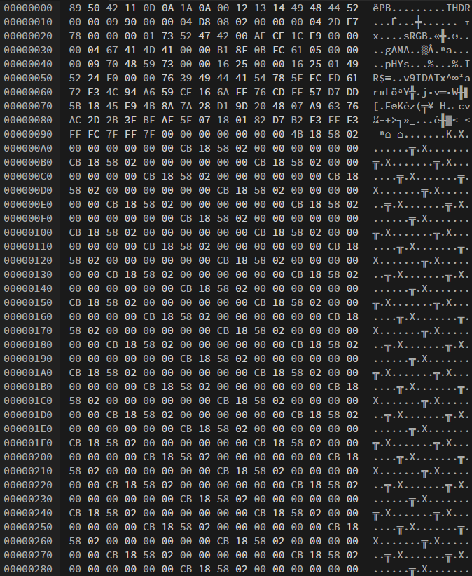
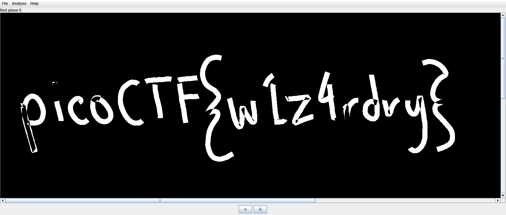

The picoCTF team decided to host picoMini by redpwn in the midst of AP and finals cram season, which was unfortunate. However, I did solve their two lowest level challenges, and their detailed step-by-step solutions are below. If you're a beginner, I hope you find this helpful!

## web - login
### Description
> My dog-sitter's brother made this website but I can't get in; can you help?
>
> login.mars.picoctf.net

### Solution
On first inspection, when faced with a [login screen](https://login.mars.picoctf.net), it seems like SQL injection, because isn't that what always happens with logins in CTFs? However, it's a lot simpler than that. After navigating to website source, we encounter `index.js`. Upon pretty-printing, it's just vanilla JS.

```js
(async()=>{
    await new Promise((e=>window.addEventListener("load", e))),
    document.querySelector("form").addEventListener("submit", (e=>{
        e.preventDefault();
        const r = {
            u: "input[name=username]",
            p: "input[name=password]"
        }
          , t = {};
        for (const e in r)
            t[e] = btoa(document.querySelector(r[e]).value).replace(/=/g, "");
        return "YWRtaW4" !== t.u ? alert("Incorrect Username") : "cGljb0NURns1M3J2M3JfNTNydjNyXzUzcnYzcl81M3J2M3JfNTNydjNyfQ" !== t.p ? alert("Incorrect Password") : void alert(`Correct Password! Your flag is ${atob(t.p)}.`)
    }
    ))
}
)();
```
The important part of the code is in line 12, where it's checking for a username and password that has been turned into Base64 from ASCII via the `btoa()` method, which is reversible with the `atob()` method. The password itself is the flag when decoded. Opening the console and running `atob("cGljb0NURns1M3J2M3JfNTNydjNyXzUzcnYzcl81M3J2M3JfNTNydjNyfQ")` results in the flag.

If you're not convinced it's the real flag, you can decode the username (`admin`) and input both into the login form, which results in an alert announcing the flag.

### Flag
```
picoCTF{53rv3r_53rv3r_53rv3r_53rv3r_53rv3r}
```

## forensics - advanced-potion-making
### Description
> Ron just found his own copy of advanced potion making, but its been corrupted by some kind of spell. Help him recover it!

### Solution
Ah, forensics. The challenge-provided `advanced-potion-making` has no file extension, but it's probably a good bet to say it's a corrupted PNG file. `file advanced-potion-making` returned `advanced-potion-making: data` (unlikely to work, but it's worth a shot and certainly "obligatory" for forensics challenges).

If a file is corrupted, it can be fixed with a hex editor such as [HexEd.it](https://hexed.it/). For a PNG file to be valid, it requires a PNG file signature and critical chunks of data. In the hex editor, we can change the incorrect parts of the chunks.



After address `0x0000009E`, most of the content is repeated and not going to be critical (save the IEND), so the bulk of our work is going to be higher up.

The PNG file header is supposed to be the first part of every PNG file and it indicates that it is a PNG file, and not anything else. It consumes the first 8 addresses with `89 50 4E 47 0D 0A 1A 0A`. The corrupted file looks somewhat similar, but not quite, so I manually fix it to agree.

We need to check the [four most important chunks](https://www.w3.org/TR/PNG-Chunks.html) to make sure they're correct: IHDR, PLTE (which ends up being optional), IDAT, and IEND. Since each PNG needs these and I didn't know their values off the top of my head, I opened a valid PNG side-by-side in the hex editor and compared their hex values. The IDHR, IDAT, and IEND looked correct.

I thought I was done and I saved my image here, but it wouldn't open. Going back to my comparison between a random valid PNG and my corrupted file, I realized that the hex values of addresses `0x00000009` to `0x0000000B` were incorrect. After changing them to `00 00 0D` to match my valid PNG, I saved it and opened it to see a red image.

So we're not done yet. Ugh.

However, when I see red (or really any solid color), I try using [stegsolve](https://github.com/zardus/ctf-tools/blob/master/stegsolve/install). I flipped through a bunch of options until `Red plane 0`, and we have our flag!

The hardest part of CTF really is reading the flag. For some reason, I thought the `1` was an `l` at first!



### Flag
```
picoCTF{w1z4rdry}
```